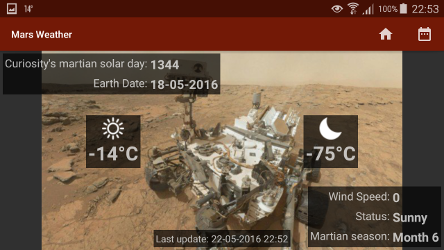

Nadeche Studer <nadeche.studer@gmail.com>

	Mars weather app.
	This app shows the latest martian weather data sent to earth by Curiosity.
  	At the start of the app the latest data is automatically loaded.
	Trough the calender icon in the actionbar the user can request weather data from any
	martian solar day 
	since Curiosity's landing on Mars. Solar day 0 signifies the landing day of Curiosity.
	To go back to the latest weather data (or check if there is new latest data) the user can
	tap on the home
	icon in the actionbar.

  	Since weather data started to come in from solar day 15 the user can search from this day
	on.
 	Curiosity didn't send back data every day, so it could be that there is no weather data
 	for the solar day the user searched for. In that case the previous data stays on screen
	and the user will be notified.

	The app shows a picture of mars in the background. 
	In portrait mode a picture is shown, Cusiosity sent back on solar day 1344 .
	In landscape mode a selfie picture of Cisiosity on mars in shown in the background.
	(solar day unknown)
 

